# LINE LIFF Influencer Marketing Platform - Requirements Document

## 1. Overview

The LINE LIFF Influencer Marketing Platform is a mobile-first web application built on the Antigravity SaaS Boilerplate (Django/React). It enables influencers to discover campaigns, apply for jobs, and submit deliverables through a streamlined workflow—all accessible via LINE's LIFF (LINE Front-end Framework).

---

## 2. Authentication & Entry Flow

### 2.1 LINE LIFF Integration

| Requirement | Description |
|-------------|-------------|
| **Entry Point** | Users access the platform exclusively via LINE LIFF |
| **User Identification** | System identifies users by `line_user_id` (from LINE profile) |
| **Session Management** | Auth tokens are managed through LIFF SDK |

### 2.2 User Status Flow


### 2.3 Status Definitions

| Status | Description | Allowed Actions |
|--------|-------------|-----------------|
| `NEW` | User has not completed registration | Registration Wizard only |
| `PENDING` | Registration complete, awaiting admin approval | View Waiting Page only |
| `APPROVED` | Admin has approved the user | Full platform access |
| `REJECTED` | Admin has rejected the user | View rejection page |

---

## 3. Protected Routes & Redirection

### 3.1 Route Protection Rules

> [!IMPORTANT]
> Users with `PENDING` status must be **force-redirected** to the `/waiting` page if they attempt to access `/jobs`, `/profile`, or any protected route.

| Route | Required Status | Fallback Redirect |
|-------|-----------------|-------------------|
| `/register` | `NEW` or no profile | `/jobs` (if approved) |
| `/waiting` | `PENDING` | `/jobs` (if approved) |
| `/jobs` | `APPROVED` | `/waiting` (if pending) or `/register` (if new) |
| `/profile` | `APPROVED` | `/waiting` (if pending) or `/register` (if new) |
| `/campaign/:id` | `APPROVED` | `/waiting` (if pending) |

### 3.2 Auto-Refresh on Waiting Page

- The `/waiting` page must **poll for status changes on mount**
- Polling interval: Every 5 seconds
- When status changes to `APPROVED`, immediately redirect to `/jobs`

---

## 4. Mock Environment for Development

### 4.1 Mock LIFF Mode

> [!TIP]
> For local development, the system must support a "Mock LIFF" mode to bypass real LINE login.

| Environment | Behavior |
|-------------|----------|
| `localhost` | Use Mock LIFF with predefined test user |
| Production | Use real LINE LIFF authentication |

### 4.2 Mock Configuration

```javascript
// Mock user for development
const MOCK_USER = {
  line_user_id: "U_DEV_12345",
  display_name: "Dev User",
  picture_url: "https://via.placeholder.com/150",
  access_token: "mock_access_token_dev"
};
```

---

## 5. Registration Wizard (3 Steps)

### 5.1 Wizard Overview

The registration process is divided into 3 sequential steps with a persistent progress indicator.


### 5.2 Step 1: Select Interests

| Field | Type | Validation |
|-------|------|------------|
| Interests | Multi-select Grid | Min 1, Max 3 selections |

**Interest Categories:**
- Fashion & Beauty
- Food & Dining
- Travel & Lifestyle
- Tech & Gaming
- Health & Fitness
- Entertainment
- Home & Living
- Education
- Pets & Animals
- Others

**UI Requirements:**
- Grid layout (2-3 columns on mobile)
- Visual cards with icons
- Selected state with checkmark overlay
- Counter showing "X/3 selected"

### 5.3 Step 2: Work Conditions

| Field | Type | Default | Description |
|-------|------|---------|-------------|
| Allow Boost | Toggle | OFF | Allow brands to boost posts |
| Boost Price | Number Input | - | Price in THB (shown when Boost is ON) |
| Allow Original File | Toggle | OFF | Provide raw/original content files |
| Original File Price | Number Input | - | Price in THB (shown when Original File is ON) |

**Conditional Logic:**
- Price inputs only appear when respective toggle is ON
- Prices must be positive integers

### 5.4 Step 3: Personal Info & Address

#### Personal Information Fields

| Field | Type | Required | Validation |
|-------|------|----------|------------|
| Full Name (Thai) | Text | Yes | Thai characters only |
| Full Name (English) | Text | Yes | English characters only |
| Phone Number | Tel | Yes | 10 digits, starts with 0 |
| Email | Email | No | Valid email format |
| Date of Birth | Date | Yes | Must be 18+ years old |

#### Thai Address Fields

| Field | Type | Required | Auto-fill Source |
|-------|------|----------|------------------|
| House Number | Text | Yes | User input |
| Village/Building | Text | No | User input |
| Moo (Village No.) | Text | No | User input |
| Soi (Lane) | Text | No | User input |
| Road | Text | No | User input |
| Sub-district (ตำบล) | Autocomplete | Yes | thai-address-database |
| District (อำเภอ) | Autocomplete | Yes | thai-address-database |
| Province (จังหวัด) | Autocomplete | Yes | thai-address-database |
| Zipcode | Text | Yes | thai-address-database |

#### Thai Address Autocomplete

> [!IMPORTANT]
> **Critical Feature**: User types Zipcode OR Sub-district → System auto-fills remaining address fields.

**Autocomplete Behavior:**
1. User starts typing zipcode (e.g., "102")
2. System shows matching sub-districts with their full address
3. User selects an option
4. Sub-district, District, Province, and Zipcode are auto-filled

#### Document Uploads

| Document | Format | Max Size | Required |
|----------|--------|----------|----------|
| ID Card (Front) | JPG, PNG, PDF | 5MB | Yes |
| ID Card (Back) | JPG, PNG, PDF | 5MB | Yes |
| Bank Book | JPG, PNG, PDF | 5MB | Yes |

### 5.5 Form Persistence (localStorage)

> [!IMPORTANT]
> **Critical Feature**: All form data must auto-save to `localStorage` for recovery.

| Event | Action |
|-------|--------|
| Field Change | Debounced save (500ms) |
| Step Navigation | Immediate save |
| App Close/Refresh | Data preserved |
| Successful Submit | Clear localStorage |

**Storage Key Structure:**
```javascript
localStorage.setItem('registration_draft', JSON.stringify({
  step: 2,
  data: {
    interests: ['fashion', 'food'],
    workConditions: { allowBoost: true, boostPrice: 500 },
    personalInfo: { fullName: '...' }
  },
  lastUpdated: '2026-01-16T12:00:00Z'
}));
```

---

## 6. Campaign (Jobs) Module

### 6.1 Campaign Dashboard

#### Sorting Priority

| Priority | Status | Description |
|----------|--------|-------------|
| 1 | `ACTIVE` | User is actively working on this campaign |
| 2 | `PENDING_REVIEW` | User submitted work, awaiting admin review |
| 3 | `OPEN` | Campaign accepting applications |
| 4 | `CLOSED` | Campaign no longer accepting applications |

#### Dashboard Card Information

Each campaign card displays:
- Brand Logo
- Campaign Title
- Short Description
- Deadline Date
- Status Badge (color-coded)
- Budget Range (if applicable)

### 6.2 Campaign Detail Page

#### Timeline View

```mermaid
flowchart TD
    subgraph Campaign Timeline
        B[📋 Brief] --> S[📝 Script]
        S --> D[🎬 Draft]
        D --> F[✅ Final]
    end
```



**Timeline Stage Display:**
- Current stage highlighted
- Completed stages with checkmark
- Future stages grayed out
- Stage-specific instructions & deadlines

### 6.3 Submission System

#### Submission Form

| Field | Type | Description |
|-------|------|-------------|
| Work Link | URL Input | Google Drive, YouTube, etc. |
| Notes | Textarea | Optional comments for admin |

#### Google Drive Link Validator

> [!CAUTION]
> **Critical Feature**: Before saving, the system MUST validate that submitted Google Drive links are publicly accessible.

**Validation Flow:**

```mermaid
flowchart TD
    A[User Enters Link] --> B[Click 'Check Link']
    B --> C{Is Google Drive?}
    C -->|No| D[Skip Validation]
    C -->|Yes| E[Send to Validator API]
    E --> F{HTTP Response?}
    F -->|200 OK| G[✅ Link is Public]
    F -->|403 Forbidden| H[❌ Link is Private]
    F -->|Error| I[⚠️ Unable to Verify]
    G --> J[Enable Submit Button]
    H --> K[Show Warning, Disable Submit]
```


**UI Feedback:**
- ✅ **Public**: Green checkmark, "Link is accessible"
- ❌ **Private/Restricted**: Red warning, "Link is private. Please enable public access."
- ⚠️ **Error**: Yellow warning, "Unable to verify. Please check the link manually."

---

## 7. Admin Approval Logic

### 7.1 User Approval Flow

> [!WARNING]
> Users **cannot apply for jobs** until Admin changes their status to `APPROVED`.

**Admin Actions:**
- View user registrations
- Review uploaded documents
- Approve or Reject users
- Add rejection reason (if rejected)

### 7.2 Content Submission Approval

At each timeline stage, admins can:
- View submitted content link
- Approve to advance to next stage
- Reject with feedback for revision
- View submission history

---

## 8. UX/UI Specifications

### 8.1 Design Theme

| Aspect | Specification |
|--------|---------------|
| Layout | Mobile-First, Responsive |
| Style | Clean, Modern, Trustworthy |
| Framework | Tailwind CSS |

### 8.2 Color Palette

| Color | Hex | Usage |
|-------|-----|-------|
| Primary (Emerald) | `#10B981` | LINE ecosystem match, success states |
| Secondary (Blue) | `#2563EB` | Primary action buttons |
| Pending (Yellow) | `#F59E0B` | Pending status badges |
| Error (Red) | `#EF4444` | Errors, rejection, warnings |
| Background | `#F9FAFB` | Page background |
| Card | `#FFFFFF` | Card backgrounds |

### 8.3 UI Components

#### Wizard Progress Bar
- Sticky at top of screen
- Green filling bar showing progress
- Step labels with current step highlighted

#### Interest Selection Grid
- Card-based grid (2 columns mobile, 3 columns tablet+)
- Shadow on selected cards
- Smooth selection animation

#### Campaign Timeline
- Vertical step-by-step progress
- Visual connectors between steps
- Clear status indicators per step

#### Submission Input
- Input field for URL
- Secondary "Check Link" button (outline style)
- Primary "Submit" button (filled style)
- Validation status icons inline

---

## 9. Non-Functional Requirements

### 9.1 Performance

| Metric | Target |
|--------|--------|
| First Contentful Paint | < 2s |
| Time to Interactive | < 3s |
| API Response Time | < 500ms |

### 9.2 Security

- All API calls authenticated via LINE access token
- Document uploads scanned for malware
- PII data encrypted at rest

### 9.3 Accessibility

- WCAG 2.1 AA compliance target
- Touch targets minimum 44px
- Sufficient color contrast

---

## 10. Appendix

### A. Glossary

| Term | Definition |
|------|------------|
| LIFF | LINE Front-end Framework |
| line_user_id | Unique identifier from LINE |
| Thai Address Autocomplete | Integration with thai-address-database package |

### B. References

- [LINE LIFF Documentation](https://developers.line.biz/en/docs/liff/)
- [thai-address-database Package](https://github.com/niceonely/thai-address-database)
- [Antigravity SaaS Boilerplate](https://github.com/antigravity-official/boilerplate)
