# User Stories - LINE LIFF Influencer Marketing Platform

## Overview

This document contains user stories with acceptance criteria for the MVP Sprint 1 of the LINE LIFF Influencer Marketing Platform. Stories are organized by epic and prioritized using MoSCoW method.

---

## Epic 1: Registration & Onboarding

### Story 1.1: Auto-Save Registration Progress

> **Priority:** Must Have

**As a** User,  
**I want** my registration data to be saved automatically if I close the app,  
**So that** I can resume filling out the form later without losing my progress.

#### Acceptance Criteria

| # | Criterion | Status |
|---|-----------|--------|
| 1 | When I change any field in the registration form, the data is saved to localStorage within 500ms | ⬜ |
| 2 | When I navigate between wizard steps, all data from previous steps is preserved | ⬜ |
| 3 | When I close the browser/app and reopen it, I am returned to my last step with all data intact | ⬜ |
| 4 | When I successfully submit the registration, the localStorage data is cleared | ⬜ |
| 5 | When I clear browser data manually, I start with a fresh form (graceful fallback) | ⬜ |
| 6 | A visual indicator (e.g., "Draft saved") briefly appears when data is auto-saved | ⬜ |

#### Technical Notes

```javascript
// localStorage key structure
{
  key: 'registration_draft',
  value: {
    step: 2,
    data: {
      interests: ['fashion', 'food'],
      workConditions: { allowBoost: true, boostPrice: 500 },
      personalInfo: { fullName: '...' }
    },
    lastUpdated: '2026-01-16T12:00:00Z'
  }
}
```

#### Edge Cases

- [ ] Handle localStorage quota exceeded error
- [ ] Handle corrupted JSON in localStorage
- [ ] Handle concurrent tabs with same draft

---

### Story 1.2: Thai Address Autocomplete

> **Priority:** Must Have

**As a** User,  
**I want** to auto-fill my address by typing the zip code or sub-district name,  
**So that** I can quickly and accurately complete my address information without manual entry.

#### Acceptance Criteria

| # | Criterion | Status |
|---|-----------|--------|
| 1 | When I start typing a zipcode (e.g., "102"), suggestions appear showing matching sub-districts | ⬜ |
| 2 | When I start typing a sub-district name in Thai, suggestions appear showing matching locations | ⬜ |
| 3 | When I select a suggestion, the Sub-district, District, Province, and Zipcode fields are auto-filled | ⬜ |
| 4 | The dropdown shows at least the sub-district, district, province, and zipcode for each option | ⬜ |
| 5 | If no matches are found, a "No results found" message is displayed | ⬜ |
| 6 | I can still manually type in all fields if I prefer not to use autocomplete | ⬜ |
| 7 | The search is performed locally (no API call) for instant results | ⬜ |

#### User Flow

```mermaid
sequenceDiagram
    participant User
    participant SearchInput
    participant ThaiAddressDB
    participant AddressFields
    
    User->>SearchInput: Types "10240"
    SearchInput->>ThaiAddressDB: searchByZipcode("10240")
    ThaiAddressDB-->>SearchInput: [{ district: "บางซื่อ", amphoe: "บางซื่อ", province: "กรุงเทพมหานคร", zipcode: 10800 }]
    SearchInput->>User: Shows dropdown with options
    User->>SearchInput: Selects "บางซื่อ, บางซื่อ, กรุงเทพ 10800"
    SearchInput->>AddressFields: Auto-fill all 4 fields
```



#### Technical Notes

- Use `thai-address-database` npm package
- Debounce search input by 300ms
- Show maximum 10 suggestions at a time

---

### Story 1.3: Registration Step Navigation

> **Priority:** Must Have

**As a** User,  
**I want** to navigate back and forth between registration steps,  
**So that** I can review and modify my information before final submission.

#### Acceptance Criteria

| # | Criterion | Status |
|---|-----------|--------|
| 1 | A progress bar at the top shows current step (1, 2, or 3) | ⬜ |
| 2 | The progress bar visually fills with green as I progress | ⬜ |
| 3 | I can click "Previous" to go back to the previous step | ⬜ |
| 4 | I cannot proceed to the next step until required fields are valid | ⬜ |
| 5 | When going back, my previously entered data is preserved | ⬜ |
| 6 | Step labels are displayed: "Interests", "Work Conditions", "Personal Info" | ⬜ |

---

## Epic 2: Campaign Discovery & Application

### Story 2.1: Campaign Dashboard Sorting

> **Priority:** Must Have

**As a** User,  
**I want** to see campaigns sorted by my active work first,  
**So that** I can quickly access campaigns I'm currently working on.

#### Acceptance Criteria

| # | Criterion | Status |
|---|-----------|--------|
| 1 | Campaigns where I have an active application appear first (status: WORK_IN_PROGRESS) | ⬜ |
| 2 | Campaigns where I've submitted work pending review appear second | ⬜ |
| 3 | Open campaigns (accepting applications) appear third | ⬜ |
| 4 | Closed campaigns appear last | ⬜ |
| 5 | Within each group, campaigns are sorted by deadline (soonest first) | ⬜ |
| 6 | Each campaign card shows a status badge (Active/Pending/Open/Closed) | ⬜ |

#### Sorting Priority Table

| Priority | User Status | Campaign Status | Badge Color |
|----------|-------------|-----------------|-------------|
| 1 | WORK_IN_PROGRESS | Any | 🟢 Green (Active) |
| 2 | SUBMITTED_* | Any | 🟡 Yellow (Pending Review) |
| 3 | No Application | OPEN | 🔵 Blue (Open) |
| 4 | Any | CLOSED | ⚪ Gray (Closed) |

---

### Story 2.2: Google Drive Link Validation

> **Priority:** Must Have

**As a** User,  
**I want** the system to warn me if my Google Drive link is restricted (Private) before I submit,  
**So that** I can fix the sharing settings and avoid having my submission rejected.

#### Acceptance Criteria

| # | Criterion | Status |
|---|-----------|--------|
| 1 | A "Check Link" button appears next to the submission URL input | ⬜ |
| 2 | When I click "Check Link", a loading spinner appears | ⬜ |
| 3 | If the link is public (HTTP 200), a green checkmark and "Link is accessible" message appears | ⬜ |
| 4 | If the link is private (HTTP 403), a red warning and "Link is private. Please enable public access." message appears | ⬜ |
| 5 | If validation fails (timeout/error), a yellow warning and "Unable to verify. Please check manually." message appears | ⬜ |
| 6 | The "Submit" button is disabled if the link is verified as private | ⬜ |
| 7 | Non-Google Drive URLs skip validation and allow submission | ⬜ |

#### UX Flow

```mermaid
flowchart TD
    A[User pastes link] --> B{Is Google Drive URL?}
    B -->|No| C[Skip validation, enable Submit]
    B -->|Yes| D[User clicks Check Link]
    D --> E{Validation Result}
    E -->|200 OK| F[✅ Show green success]
    E -->|403 Forbidden| G[❌ Show red warning]
    E -->|Error/Timeout| H[⚠️ Show yellow warning]
    F --> I[Enable Submit button]
    G --> J[Disable Submit button]
    G --> K[Show instructions to fix sharing]
    H --> I
```



#### Technical Notes

```javascript
// API Endpoint
POST /api/v1/validate-drive-link/
Request: { "link": "https://drive.google.com/..." }
Response: { "valid": true, "accessible": true|false, "message": "..." }
```

---

## Epic 3: Admin Controls

### Story 3.1: Block Unapproved Users from Jobs

> **Priority:** Must Have

**As an** Admin,  
**I want** users to be blocked from the Job Board until I approve them,  
**So that** I can verify user identities and documents before allowing campaign applications.

#### Acceptance Criteria

| # | Criterion | Status |
|---|-----------|--------|
| 1 | Users with status `PENDING` cannot access the `/jobs` page | ⬜ |
| 2 | When a `PENDING` user tries to access `/jobs`, they are redirected to `/waiting` | ⬜ |
| 3 | Users with status `PENDING` cannot access individual campaign pages | ⬜ |
| 4 | The API returns 403 Forbidden if a non-approved user tries to apply to a campaign | ⬜ |
| 5 | Admin can view a list of pending users with their documents | ⬜ |
| 6 | Admin can approve or reject a user with one click | ⬜ |
| 7 | When Admin approves a user, their status changes to `APPROVED` immediately | ⬜ |

#### Route Protection Matrix

| Route | NEW | PENDING | APPROVED | REJECTED |
|-------|-----|---------|----------|----------|
| `/register` | ✅ | ➡️ `/waiting` | ➡️ `/jobs` | ➡️ `/rejected` |
| `/waiting` | ➡️ `/register` | ✅ | ➡️ `/jobs` | ➡️ `/rejected` |
| `/jobs` | ➡️ `/register` | ➡️ `/waiting` | ✅ | ➡️ `/rejected` |
| `/campaign/:id` | ➡️ `/register` | ➡️ `/waiting` | ✅ | ➡️ `/rejected` |
| `/profile` | ➡️ `/register` | ➡️ `/waiting` | ✅ | ➡️ `/rejected` |

---

### Story 3.2: Waiting Page Auto-Refresh

> **Priority:** Should Have

**As a** User,  
**I want** the waiting page to automatically check my approval status,  
**So that** I am redirected to the job board as soon as I'm approved without manual refresh.

#### Acceptance Criteria

| # | Criterion | Status |
|---|-----------|--------|
| 1 | On mount, the `/waiting` page fetches the current user status | ⬜ |
| 2 | The page polls for status changes every 5 seconds | ⬜ |
| 3 | When status changes to `APPROVED`, user is immediately redirected to `/jobs` | ⬜ |
| 4 | When status changes to `REJECTED`, user is redirected to `/rejected` page | ⬜ |
| 5 | A friendly "Waiting for approval" message with animation is displayed | ⬜ |
| 6 | A "Refresh manually" button is available for users who want to check immediately | ⬜ |
| 7 | Polling stops when component unmounts (cleanup) | ⬜ |

#### Technical Notes

```javascript
// Polling implementation
useEffect(() => {
  const checkStatus = async () => {
    const { status } = await api.get('/auth/me/');
    if (status === 'APPROVED') {
      navigate('/jobs');
    } else if (status === 'REJECTED') {
      navigate('/rejected');
    }
  };
  
  checkStatus(); // Check on mount
  const interval = setInterval(checkStatus, 5000);
  
  return () => clearInterval(interval);
}, []);
```

---

## Epic 4: Developer Experience

### Story 4.1: Mock LIFF Mode for Development

> **Priority:** Must Have

**As a** Developer,  
**I want** to use a Mock LIFF mode when running on localhost,  
**So that** I can develop and test without requiring real LINE login.

#### Acceptance Criteria

| # | Criterion | Status |
|---|-----------|--------|
| 1 | When `VITE_MOCK_LIFF=true`, the app uses mock LIFF service | ⬜ |
| 2 | Mock mode provides a pre-defined test user profile | ⬜ |
| 3 | Mock mode bypasses `liff.login()` call | ⬜ |
| 4 | Mock mode provides mock access token for API authentication | ⬜ |
| 5 | The console logs "[LIFF] Running in Mock Mode" when active | ⬜ |
| 6 | In production (`VITE_MOCK_LIFF=false`), real LIFF SDK is used | ⬜ |
| 7 | Backend accepts mock tokens when `DEBUG=True` | ⬜ |

#### Mock User Configuration

```javascript
const MOCK_USER = {
  userId: "U_DEV_12345",
  displayName: "Dev User",
  pictureUrl: "https://via.placeholder.com/150",
  statusMessage: "Testing in dev mode"
};
```

---

## Epic 5: Campaign Workflow

### Story 5.1: Campaign Timeline View

> **Priority:** Should Have

**As a** User,  
**I want** to see a visual timeline of campaign stages,  
**So that** I understand the workflow and know what stage I'm currently in.

#### Acceptance Criteria

| # | Criterion | Status |
|---|-----------|--------|
| 1 | Campaign detail page shows a vertical timeline with 4 stages: Brief → Script → Draft → Final | ⬜ |
| 2 | Completed stages show a green checkmark | ⬜ |
| 3 | Current stage is highlighted and expanded with action buttons | ⬜ |
| 4 | Future stages are grayed out | ⬜ |
| 5 | Each stage shows its name, icon, and brief description | ⬜ |
| 6 | If a stage has admin feedback, it's displayed within that stage | ⬜ |
| 7 | Submission links for completed stages are viewable | ⬜ |

#### Timeline UI Mockup

```
┌─────────────────────────────────────┐
│  📋 Brief                     ✅    │
│  Campaign brief reviewed            │
│  ─────────────────────────────────  │
│  📝 Script                    ✅    │
│  Script submitted & approved        │
│  Link: docs.google.com/...          │
│  ─────────────────────────────────  │
│  🎬 Draft                    🔵     │  ← Current Stage
│  Submit your draft content          │
│  ┌─────────────────────────────┐   │
│  │ [Enter Google Drive link]   │   │
│  │ [Check Link] [Submit Draft] │   │
│  └─────────────────────────────┘   │
│  ─────────────────────────────────  │
│  ✅ Final                    ⚫    │
│  Publish final content              │
└─────────────────────────────────────┘
```

---

### Story 5.2: Content Submission Flow

> **Priority:** Should Have

**As a** User,  
**I want** to submit my work links for each campaign stage,  
**So that** admins can review and approve my content.

#### Acceptance Criteria

| # | Criterion | Status |
|---|-----------|--------|
| 1 | I can only submit for my current stage (cannot skip stages) | ⬜ |
| 2 | The submission form has a URL input field and optional notes textarea | ⬜ |
| 3 | Before submission, the system validates Google Drive links (Story 2.2) | ⬜ |
| 4 | After successful submission, the stage shows "Pending Review" status | ⬜ |
| 5 | If admin requests revision, I see their feedback and can resubmit | ⬜ |
| 6 | After admin approves, the next stage becomes active | ⬜ |
| 7 | I receive a success toast notification after submission | ⬜ |

---

## Story Priority Summary

### Must Have (P0)

| Story ID | Title | Epic |
|----------|-------|------|
| 1.1 | Auto-Save Registration Progress | Registration |
| 1.2 | Thai Address Autocomplete | Registration |
| 1.3 | Registration Step Navigation | Registration |
| 2.1 | Campaign Dashboard Sorting | Campaigns |
| 2.2 | Google Drive Link Validation | Campaigns |
| 3.1 | Block Unapproved Users from Jobs | Admin |
| 4.1 | Mock LIFF Mode for Development | DevEx |

### Should Have (P1)

| Story ID | Title | Epic |
|----------|-------|------|
| 3.2 | Waiting Page Auto-Refresh | Admin |
| 5.1 | Campaign Timeline View | Campaigns |
| 5.2 | Content Submission Flow | Campaigns |

### Could Have (P2)

| Story ID | Title | Epic |
|----------|-------|------|
| - | Email notifications | Notifications |
| - | Push notifications via LINE | Notifications |
| - | Admin dashboard analytics | Admin |

---

## Definition of Done

A story is considered **Done** when:

1. ✅ All acceptance criteria are met
2. ✅ Code is reviewed and merged to main branch
3. ✅ Unit tests written with >80% coverage for new code
4. ✅ Integration tests pass
5. ✅ No critical or high-severity bugs
6. ✅ UI matches design specifications
7. ✅ Accessibility requirements met (WCAG 2.1 AA)
8. ✅ Documentation updated (if applicable)
9. ✅ Product Owner accepts the implementation
